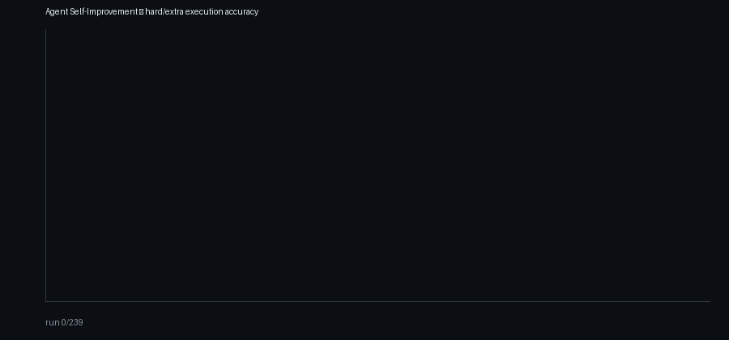

# Agent Self-Improvement

[](https://github.com/rohanpc0701/agent-self-improvement/actions/workflows/ci.yml)

Open-source harness for **runtime self-correction** of verifiable agents: detect accuracy drift, repair failures with a stronger teacher, store `(trap, fix)` rules in a knowledge graph, and re-run with learned context — no fine-tuning, no human in the loop.

Domains plug in through a `TaskAdapter` (`coding`, `spider`, `gsm8k`). The primary measured domain is **hard coding** (unit-test verified Python).



---

## Results

### Coding (primary) — Prime student + teacher + KG

| | |
|---|---|
| Student | `meta-llama/Llama-3.2-3B-Instruct` via [Prime Inference](https://docs.primeintellect.ai/inference/overview) |
| Teacher | `minimax/minimax-m2.5` on Prime (called only on drift) |
| Eval | Hard held-out unique questions, sandboxed unit tests (`fixtures/coding_subset.json`, 70 problems) |
| Feedback | Teacher-verified few-shots + topic-scoped KG rules (`AGENT_USE_RULES=1`) |

| Hard-bucket accuracy (11 unique held-out questions) | |
|---|---|
| WITHOUT examples / rules | 0.273 |
| WITH correction (recovered) | **0.455** |
| **Δ** | **+0.182** |

On that run: drift fired (`severity=0.320`), correction produced **15 teacher / 1 gold / 2 anchor** examples, and **3** KG rules were written. Reproduce:

```bash
# .env: PRIME_API_KEY=...
bash scripts/use_prime_student.sh smoke   # student + teacher unit-test check
bash scripts/use_prime_student.sh full    # baseline → drift → teacher+KG → recovery
```

### Spider (secondary / historical)

| Config | WITHOUT | WITH | Δ |
|---|---|---|---|
| Local Qwen2.5-1.5B + MiniMax teacher, examples only (`AGENT_USE_RULES=0`) | 0.100 | 0.333 | +0.233 |
| Hackathon MiniMax M2.7 student + M3 teacher | 0.300 | 0.567 | +0.267 |

Spider detail (dose-response, McNemar, KG A/B) lives in [`docs/design.md`](docs/design.md). GSM8K is wired as an adapter; do not claim a held-out Δ until measured.

---

## Loop

```
  Harness ──TelemetryRecord──▶ Detector ──DriftEvent──▶ Correction
     ▲                                                       │
     └──── few-shot examples + KG rules (runtime feedback) ──┘
                  all stages ──▶ events.jsonl ──▶ Viewer
```

| Stage | Role |
|-------|------|
| **[Harness](harness/)** | Runs the student on a change-point feed (easy baseline → hard degraded → hard recovery) |
| **[Detector](detector/)** | Windowed drift on `execution_accuracy`; emits `failing_run_ids` + failure mode |
| **[Correction](correction/)** | Teacher repair → verify → few-shots; distill `(trap, fix)` into the KG |
| **[Viewer](viewer/)** | Live recovery curve + correction timeline from `events.jsonl` |

Learning is the growing `AgentConfig.few_shot_examples` list (and optional KG prompt injection). The student model is not swapped for a larger one.

**Measurement guardrails:** hard-bucket only; unique-question accuracy; LEARN vs HELD-OUT split so recovery is out-of-sample.

---

## Quickstart

```bash
pip install -e .   # Python ≥ 3.10
python fixtures/generate_mocks.py
```

### Coding on Prime (recommended)

```bash
# .env
# PRIME_API_KEY=...

bash scripts/use_prime_student.sh list
bash scripts/use_prime_student.sh smoke
bash scripts/use_prime_student.sh probe          # cheap WITH/WITHOUT (~22 calls)
bash scripts/use_prime_student.sh full           # full loop + KG on recovery
bash scripts/use_prime_student.sh compare        # after full: student+memory vs teacher
bash scripts/use_prime_student.sh curriculum     # hard-curriculum eval (see below)
# or one shot: bash scripts/use_prime_student.sh full-compare
```

**Hard-curriculum eval** (the intended product measurement):

1. Easy warmup only for the detector (~40) — not the teaching diet  
2. ~100 hard LEARN instances → drift → teacher few-shots + KG  
3. Freeze memory  
4. Score **student+memory vs unaided teacher** on held-out hard (never in LEARN)

```bash
bash scripts/use_prime_student.sh curriculum
# N_LEARN=120 N_HELDOUT=40 bash scripts/use_prime_student.sh curriculum
```


Overrides: `PRIME_AGENT_MODEL=...` (student), `PRIME_TEACHER_MODEL=...` (teacher).

### Local student (Ollama) + optional MiniMax teacher

```bash
ollama pull qwen2.5:1.5b-instruct
export AGENT_BASE_URL=http://localhost:11434/v1
export AGENT_MODEL=qwen2.5:1.5b-instruct
# optional if not using TEACHER_USE_PRIME=1:
export MINIMAX_API_KEY=sk-...

python orchestrator.py --adapter coding --full --fresh
```

### Other adapters / gates

```bash
python orchestrator.py --adapter spider --full --fresh
python orchestrator.py --adapter gsm8k --full --fresh

python orchestrator.py --adapter coding --probe
python orchestrator.py --adapter coding --dry-run-heldout
python orchestrator.py --adapter coding --significance   # after a --full run
```

### Viewer (no API key)

```bash
pip install -r requirements.txt
make demo
# or: VIEWER_LOG=events.jsonl uvicorn viewer.app:app --port 8011
```

---

## Layout

```
contracts/       Shared Pydantic schemas + events.jsonl I/O
core/            TaskAdapter protocol
adapters/        coding, spider_sql, gsm8k_math
harness/         Student client, feed, Spider eval, coding sandbox
detector/        Windowed drift detection
correction/      Teacher, verify, anchors, KG (graph / inject / distill)
viewer/          FastAPI + Chart.js
fixtures/        Coding subset, Spider/GSM8K slices, demo event logs
scripts/         use_prime_student.sh, run_coding_eval.sh, multi_seed_eval.py
orchestrator.py  End-to-end loop (--adapter, --continuous, --fresh)
```

```bash
pytest    # 231 tests (hermetic; no live API required)
```

---

## Author

[Rohan Chavan](https://github.com/rohanpc0701)
